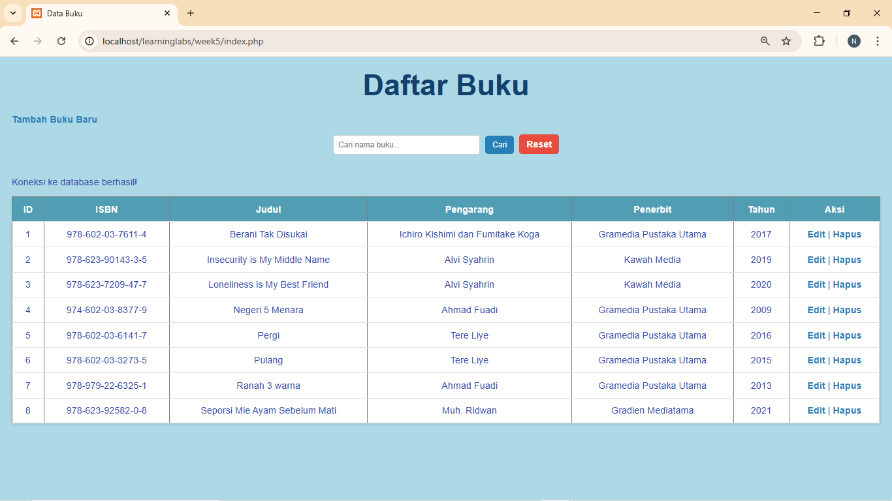

# 📚 Aplikasi CRUD Data Buku (PHP + MySQL)

Aplikasi ini merupakan program sederhana untuk mengelola data buku menggunakan PHP dan MySQL. Fitur utama meliputi menampilkan data, mencari buku, menambah data baru, mengedit data, dan menghapus data.

---

## ✨ Fitur Utama
- Menampilkan daftar buku dalam bentuk tabel  
- Fitur pencarian berdasarkan judul buku  
- Tambah data buku  
- Edit data buku  
- Hapus data buku  
- Validasi input dasar  
- Menggunakan prepared statements (lebih aman dari SQL Injection)

---

## 🛠 Teknologi yang Digunakan
- PHP
- MySQLi (Prepared Statement)
- HTML5
- CSS3
- XAMPP / Laragon (Opsional untuk server)

---

## Screenshot

## Kontributor
- Nisa Rahmawati